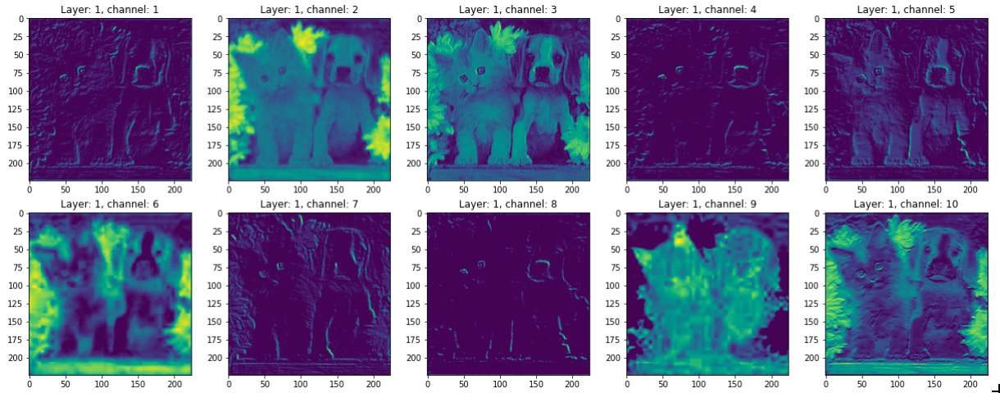

# Convolutional Neural Network
## Visualization
CNNs are powerful algorithms and they extract useful information information when trained on largescale dataset. The information they extract is also often interpretable and can be visualized 2D space. There are two types of CNN layer visualization. The first is CNN layer output visualization and the second is CNN layer activation visualization.
### Output Visualization
Each channelof CNN layer's output can be viewed as a single image. This makes it easier to plot the output of CNN layers on 2D space the following image shows the output of first layer from VGG network.

For more inforation and visualization please follow [this](CNN_Output_Visualization.ipynb)

### Activation Visualization
